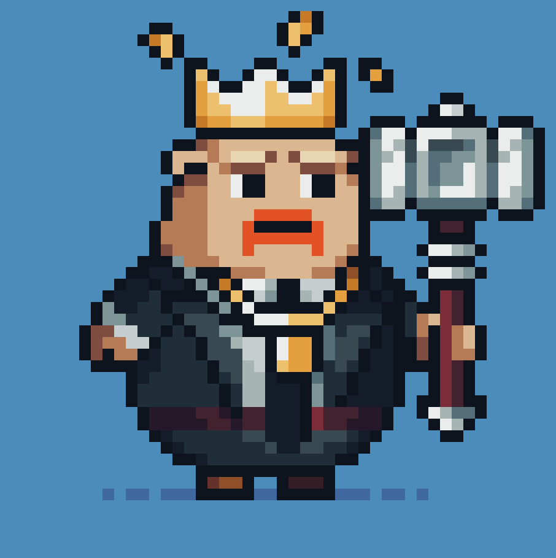
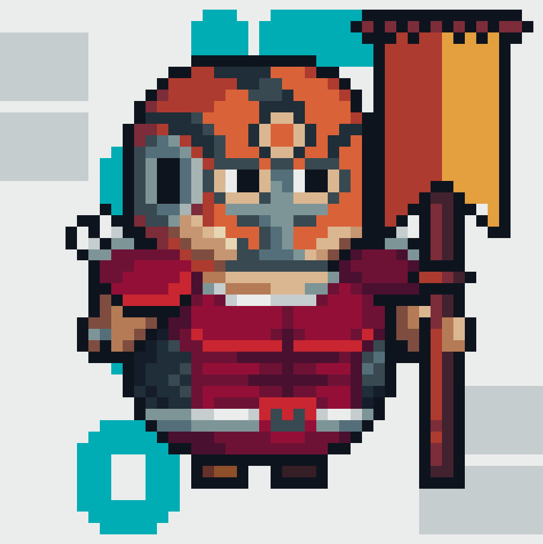
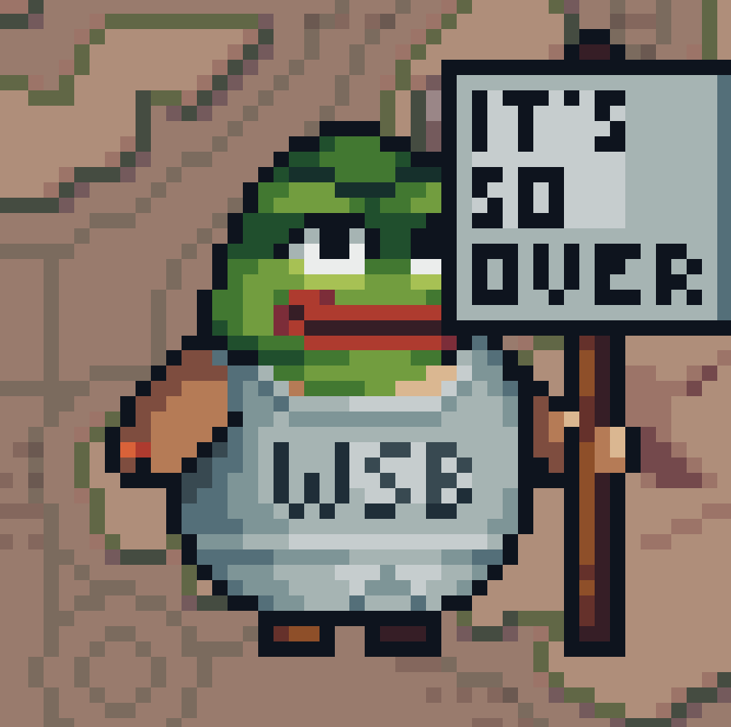
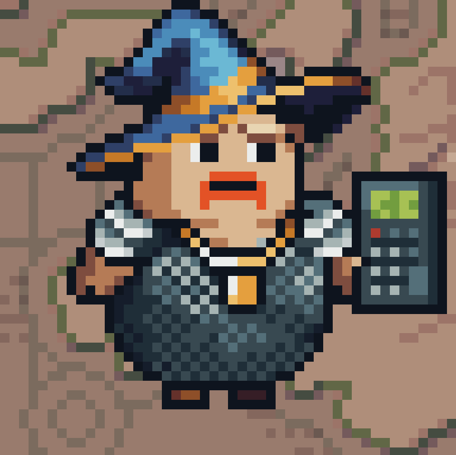

### Draft Blobert-Showdown

This is a game for [DojoJam4](https://itch.io/jam/dojo-game-jam-4), with the Blobert/Realms track.

We are adapting from the popular game [Pokemon Showdown](https://pokemonshowdown.com/) onto Blobert in hopes of using it as a base game for our on-chain Reinforcement Learning training and integration framework that will be built subsequently. It will serve as good UI/UX studies for future turn-based games that would like to add a RL/AI model Bot v Bot module to their project.

CLICK PICTURE TO SEE DEMO!!!

#### Battle Mechanics

We follow mostly similar turn and damage mechanics as Pokemon Gen 1, where the damage formula follows something like:

`Damage=( 
50
(2×Level)/5+2×Power×A/D
​
 +2)×Modifier`

- Level: The level of the attacking Pokémon.
- Power: The power of the specific move being used.
- A: The Attack or Special stat of the attacking Pokémon (depending on the move's category).
- D: The Defense or Special stat of the defending Pokémon (depending on the move's category).
- Modifier: A combination of several factors including STAB, type effectiveness, critical hit multiplier, and other in-game effects (like badges).  

The Modifier is calculated as follows:

 `Modifier=STAB×Type Effectiveness×Critical×Other×Random Number` 

- STAB (Same Type Attack Bonus): This is 1.5 if the move's type matches one of the attacking Pokémon's types, otherwise it's 1.
- Type Effectiveness: This can be 0 (no effect), 0.5 (not very effective), 1 (normal), or 2 (super effective), depending on the move's type against the defender's type(s).
- Critical: Critical hits double the damage. The base chance of a critical hit is based on the Pokémon's base Speed stat, but for simplicity in calculation, you can consider it as a 1 (no critical hit) or 2 (critical hit).
- Other: Other modifiers could include specific in-game items or effects but are usually set to 1.
- Random Number: A random multiplier between 0.85 and 1.00 to introduce variability.

#### Blobert Type Chart

We try to mimic the damage modifiers with Pokemon Type charts such as below:

 

We drafted a first version of the Blobert Type chart for Dojo Jam 4. But the final values will be open to the community to vote and decide in future (also considering balance designs).

Some examples of Blobert Type are below:

Normie Blobert:   

Degen Tradoor:  

VC:   

Dev:     

Influenza:   

Gamer:    

NFT-Colecktoor:     

Meme Coiner:   

Eco & Infra:     

Defi Farmer:   

